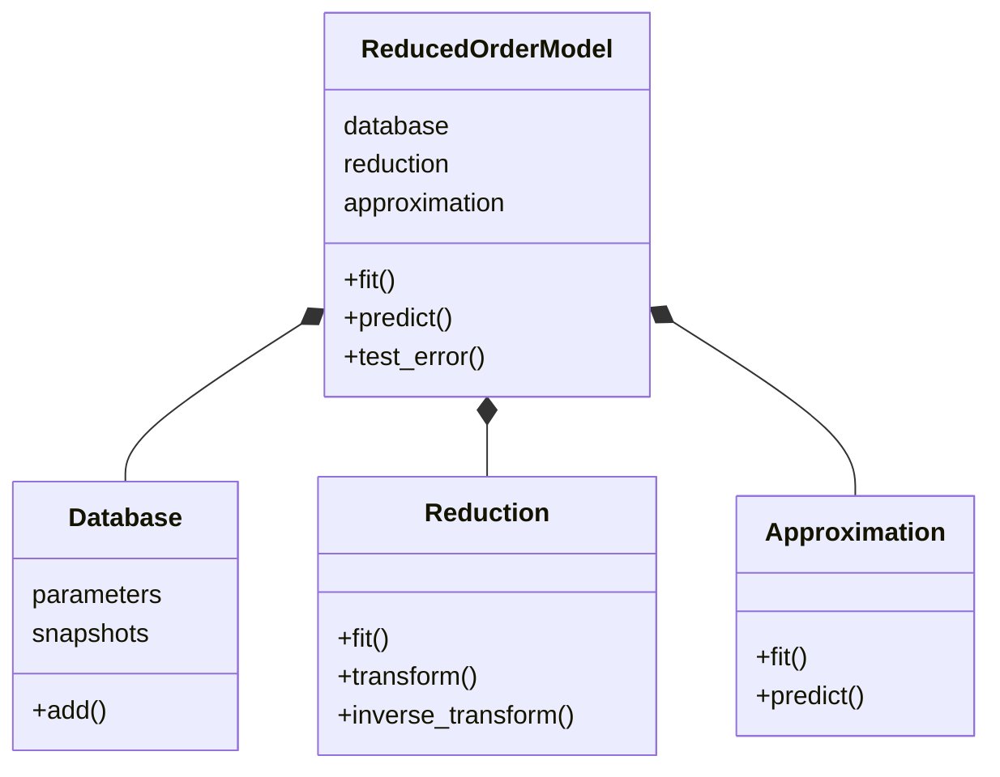

<p align="center">
  <a href="https://mathlab.github.io/EZyRB" target="_blank" >
    
  </a>
</p>
<p align="center">
    <a href="https://doi.org/10.21105/joss.00661" target="_blank">
        
    </a>
    <a href="https://github.com/mathLab/EZyRB/blob/master/LICENSE.rst" target="_blank">
        
    </a>
    <a href="https://badge.fury.io/py/ezyrb">
        
    </a>
    <a href="https://github.com/mathLab/EZyRB/actions/workflows/testing_pr.yml" target="_blank">
        
    </a>
    <a href="https://www.codacy.com/gh/mathLab/EZyRB/dashboard?utm_source=github.com&utm_medium=referral&utm_content=mathLab/EZyRB&utm_campaign=Badge_Coverage" target="_blank">
        
    </a>
    <a class="badge-align" href="https://www.codacy.com/gh/mathLab/EZyRB/dashboard?utm_source=github.com&amp;utm_medium=referral&amp;utm_content=mathLab/EZyRB&amp;utm_campaign=Badge_Grade">
        
    </a>
</p>

**EZyRB**: Easy Reduced Basis method

## Table of contents
* [Description](#description)
* [Dependencies and installation](#dependencies-and-installation)
* [Documentation](#documentation)
* [Testing](#testing)
* [Examples](#examples)
* [How to cite](#how-to-cite)
	* [Recent works with EZyRB](#recent-works-with-ezyrb)
* [Authors and contributors](#authors-and-contributors)
* [How to contribute](#how-to-contribute)
	* [Submitting a patch](#submitting-a-patch)
* [SISSA mathLab packages for reduced order modeling](#sissa-mathlab-packages-for-reduced-order-modeling)
* [License](#license)

## Description
**EZyRB** is a Python package that performs a *data-driven model order reduction* for parametrized problems exploiting the recent approaches.
Such techniques are able to provide a parametric model capable to provide the real-time approximation of the solution of a generic (potentially complex and non linear) problem. The reduced model is totally built upon the numerical data obtained by the original (to reduce) model, without requiring any knowledge of the equations that describe this model, resulting in a well suited framework for industrial contexts due to its natural capability to been integrated with commercial software.

#### The POD-based approach
Widely exploited in the reduced basis community, the **Proper Orthogonal Decomposition** (also called principal analysis components) results effective also in a data-driven context, reducing dimensionality of the input data. It has been indeed exploited in several methods, like POD with Interpolation (PODI), POD with Gaussian process regression (POD-GPR) or POD with neural network (POD-NN).
More in general, in the data-driven context it is usually coupled with a generic regression/interpolation techniques for the approximation of the solution.

#### Simple interface
The software interface has been kept as simple and intuitive as possible. Few lines of code are sufficient to built and query the reduced model, assuming the input parameters and snapshots are already available. The following lines show a minimal but working example using PODI (RBF used as interpolation method):
```python
from ezyrb import POD, RBF, Database
from ezyrb import ReducedOrderModel as ROM

## input
params, snapshots = extract_params_and_snapshots(...) # my input data
new_param = input('The new parametric point where solution will be predicted: ')

db = Database(params, snapshots)
pod = POD('svd')
rbf = RBF()
    
rom = ROM(db, pod, rbf)
rom.fit();

rom.predict(new_param)
```

The package provides different reduction methods and regressors. The high level structure of the library is represented here:


See the [**Examples**](#examples) section below and the [**Tutorials**](tutorials/README.md) to have an idea of the potential of this package.

## Dependencies and installation
**EZyRB** requires `numpy`, `scipy`, `sklearn`, `matplotlib`, `torch`,
`pytest` (for local test) and `sphinx` (to generate the documentation). The code
has been tested with Python3.5 version, but it should be compatible with
Python3. It can be installed using `pip` or directly from the source code.

### Installing from source
The official distribution is on GitHub, and you can clone the repository using
```bash
> git clone https://github.com/mathLab/EZyRB
```

To install the latest version of the package just type:
```bash
> pip install git+https://github.com/mathLab/EZyRB
```

Otherwise to install your own local branch you can use
```bash
> pip install -e .
```

To uninstall the package just use pip again:
```bash
> pip uninstall ezyrb
```

## Documentation
**EZyRB** uses [Sphinx](http://www.sphinx-doc.org/en/stable/) for code documentation. To build the html versions of the docs simply:

```bash
> cd docs
> make html
```

The generated html can be found in `docs/build/html`. Open up the `index.html` you find there to browse.


## Testing
We are using the Github Actions for continuous intergration testing. You can check out the current status [here](https://github.com/mathLab/EZyRB/actions/workflows/testing_pr.yml).

To run tests locally:

```bash
> pytest
```


## Examples

You can find useful tutorials on how to use the package in the [tutorials](tutorials/README.md) folder.
Here we show an application taken from the **automotive** engineering field

<p align="center">

</p>
<p align="center">
<em>The first POD modes of the pressure field on the DrivAer model.</em>
</p>

<p align="center">

</p>
<p align="center">
<em>DrivAer model online evaluation: pressure (left) and wall shear stress (right) fields and errors.</em>
</p>


## How to cite
If you use this package in your publications please cite the package as follows:

Demo et al., (2018). EZyRB: Easy Reduced Basis method. Journal of Open Source Software, 3(24), 661, [https://doi.org/10.21105/joss.00661](https://doi.org/10.21105/joss.00661)

Or if you use LaTeX:

```tex
@article{demo18ezyrb,
  Author = {Demo, Nicola and Tezzele, Marco and Rozza, Gianluigi},
  Title = {{EZyRB: Easy Reduced Basis method}},
  Journal = {The Journal of Open Source Software},
  Volume = {3},
  Number = {24},
  Pages = {661},
  Year = {2018},
  Doi = {https://doi.org/10.21105/joss.00661}
}
```

### Recent works with EZyRB
Here there is a list of the scientific works involving **EZyRB** you can consult and/or cite. If you want to add one, please open a PR.

* Tezzele, Demo, Rozza. *A non-intrusive approach for proper orthogonal decomposition modal coefficients reconstruction through active subspaces*. Comptes Rendus de l'Academie des Sciences DataBEST 2019 Special Issue, in press. [[arXiv](https://arxiv.org/abs/1907.12777)] [[bibitem](readme/demo2019cras.bib)] .

* Tezzele, Demo, Rozza. *Shape optimization through proper orthogonal decomposition with interpolation and dynamic mode decomposition enhanced by active subspaces*. In Proceedings of MARINE 2019: VIII International Conference on Computational Methods in Marine Engineering, pages 122-133, 2019. [[DOI](https://congress.cimne.com/marine2019/frontal/Doc/EbookMarine2019.pdf)] [[arXiv](https://arxiv.org/abs/1905.05483)] [[bibitem](readme/tezzele2019marine.bib)].

* Demo, Tezzele, Mola, Rozza. *A complete data-driven framework for the efficient solution of parametric shape design and optimisation in naval engineering problems*. In Proceedings of MARINE 2019: VIII International Conference on Computational Methods in Marine Engineering, pages 111-121, 2019. [[DOI](https://congress.cimne.com/marine2019/frontal/Doc/EbookMarine2019.pdf)] [[arXiv](https://arxiv.org/abs/1905.05982)] [[bibitem](readme/demo2019marine.bib)].

* Garotta, Demo, Tezzele, Carraturo, Reali, Rozza. *Reduced Order Isogeometric Analysis Approach for PDEs in Parametrized Domains*. Submitted, 2018. [[arXiv](https://arxiv.org/abs/1811.08631)] [[bibitem](readme/garotta2018quiet.bib)].

* Tezzele, Demo, Mola, Rozza. *An integrated data-driven computational pipeline with model order reduction for industrial and applied mathematics*. Submitted, 2018. [[arXiv](https://arxiv.org/abs/1810.12364)] [[bibitem](readme/tezzele2018ecmi.bib)].

* Salmoiraghi, Scardigli, Telib, Rozza. *Free-form deformation, mesh morphing and reduced-order methods: enablers for efficient aerodynamic shape optimisation*. International Journal of Computational Fluid Dynamics, 32:4-5, 233-247, 2018. [[DOI](https://doi.org/10.1080/10618562.2018.1514115)] [[arXiv](https://arxiv.org/abs/1803.04688)] [[bibitem](readme/salmoiraghi2018free.bib)].

* Demo, Tezzele, Gustin, Lavini, Rozza. *Shape optimization by means of proper orthogonal decomposition and dynamic mode decomposition*. In Technology and Science for the Ships of the Future: Proceedings of NAV 2018: 19th International Conference on Ship & Maritime Research, 2018. [[DOI](https://doi.org/10.3233/978-1-61499-870-9-212)] [[arXiv](https://arxiv.org/abs/1803.07368)] [[bibitem](readme/demo2018shape.bib)].


## Authors and contributors
**EZyRB** is currently developed and mantained at [SISSA mathLab](http://mathlab.sissa.it/) by
* [Nicola Demo](mailto:demo.nicola@gmail.com)
* [Marco Tezzele](mailto:marcotez@gmail.com)

under the supervision of [Prof. Gianluigi Rozza](mailto:gianluigi.rozza@sissa.it). We thank [Filippo Salmoiraghi](mailto:filippo.salmoiraghi@gmail.com) for the original idea behind this package and the major contributions.

Contact us by email for further information or questions about **EZyRB**, or suggest pull requests. **EZyRB** is at an early development stage, so contributions improving either the code or the documentation are welcome!


## How to contribute
We'd love to accept your patches and contributions to this project. There are
just a few small guidelines you need to follow.

### Submitting a patch

  1. It's generally best to start by opening a new issue describing the bug or
     feature you're intending to fix.  Even if you think it's relatively minor,
     it's helpful to know what people are working on.  Mention in the initial
     issue that you are planning to work on that bug or feature so that it can
     be assigned to you.

  2. Follow the normal process of [forking][] the project, and setup a new
     branch to work in.  It's important that each group of changes be done in
     separate branches in order to ensure that a pull request only includes the
     commits related to that bug or feature.

  3. To ensure properly formatted code, please make sure to use 4
     spaces to indent the code. The easy way is to run on your bash the provided
     script: ./code_formatter.sh. You should also run [pylint][] over your code.
     It's not strictly necessary that your code be completely "lint-free",
     but this will help you find common style issues.

  4. Any significant changes should almost always be accompanied by tests.  The
     project already has good test coverage, so look at some of the existing
     tests if you're unsure how to go about it. We're using [coveralls][] that
     is an invaluable tools for seeing which parts of your code aren't being
     exercised by your tests.

  5. Do your best to have [well-formed commit messages][] for each change.
     This provides consistency throughout the project, and ensures that commit
     messages are able to be formatted properly by various git tools.

  6. Finally, push the commits to your fork and submit a [pull request][]. Please,
     remember to rebase properly in order to maintain a clean, linear git history.

[forking]: https://help.github.com/articles/fork-a-repo
[pylint]: https://www.pylint.org/
[coveralls]: https://coveralls.io
[well-formed commit messages]: http://tbaggery.com/2008/04/19/a-note-about-git-commit-messages.html
[pull request]: https://help.github.com/articles/creating-a-pull-request

## SISSA mathLab packages for reduced order modeling

Below you can find a list of useful reduced order modelling packages from SISSA mathLab group:
* **PyGeM**: Python library for Geometrical Morphing, that uses free form deformation to parametrize and morph complex geometries, [https://github.com/mathLab/PyGeM](https://github.com/mathLab/PyGeM).
* **PyDMD**: Python library for Dynamic Mode Decomposition, for a data-driven model simplification based on spatiotemporal coherent structures, [https://github.com/mathLab/PyDMD](https://github.com/mathLab/PyDMD).
* **RBniCS**: reduced order modelling in FEniCS, is an implementation in FEniCS of several reduced order modelling techniques for parametrized problems, [https://github.com/mathLab/RBniCS](https://github.com/mathLab/RBniCS).
* **BladeX**: Python Package for Blade Deformation, for geometrical parametrization and bottom-up construction of propeller blades, [https://github.com/mathLab/BladeX](https://github.com/mathLab/BladeX).
* **ITHACA-FV**: In real Time Highly Advanced Computational Applications for Finite Volumes, is C++ library based on the finite volume solver OpenFOAM. It consists of the implementation of several reduced order modeling techniques for parametrized problems, [https://github.com/mathLab/ITHACA-FV](https://github.com/mathLab/ITHACA-FV).
* **ITHACA-DG**: In real Time Highly Advanced Computational Applications for Discontinuous Galerkin Methods, is C++ library based on the Discontinuous Galerkin Methods solver HopeFOAM. It consists of the implementation of reduced order modeling techniques for parametrized problems, [https://github.com/mathLab/ITHACA-DG](https://github.com/mathLab/ITHACA-DG).
* **ITHACA-SEM**: In real Time Highly Advanced Computational Applications for Spectral Element Methods, is C++ library based on the spectral element solver Nektar++. It consists of the implementation of several reduced order modeling techniques for parametrized problems, [https://github.com/mathLab/ITHACA-SEM](https://github.com/mathLab/ITHACA-SEM).

## License

See the [LICENSE](LICENSE.rst) file for license rights and limitations (MIT).
