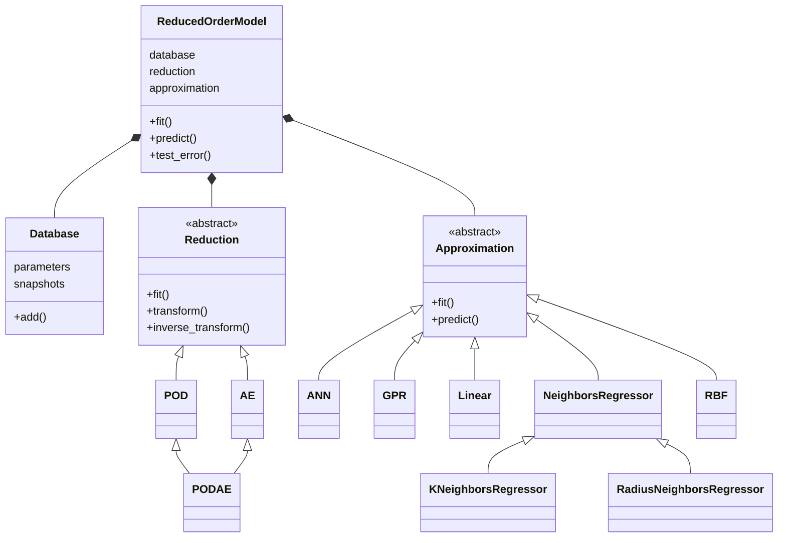

# Tutorials

In this folder you can find a collection of useful tutorials in order to understand the principles and the potential of **EZyRB**.

[Tutorial 1](tutorial-1.ipynb) shows how to construct a simple reduced order model for a heat conduction problem.

[Tutorial 2](tutorial-2.ipynb) shows how test different methods for reduced order modeling on a NavierStokes 2D problem.

#### More to come...
We plan to add more tutorials but the time is often against us. If you want to contribute with a notebook on a feature not covered yet we will be very happy and give you support on editing!

## General structure
The complete structure of the package can be summarized with the following diagram:

